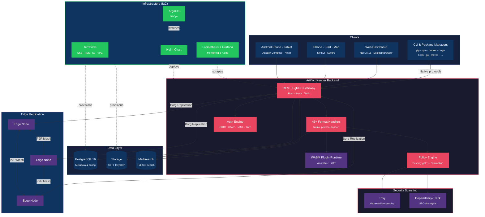
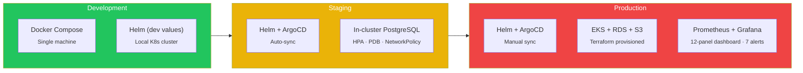

<p align="center">
  
</p>

<p align="center">
  <strong>Your packages. Your servers. Your freedom.</strong>
</p>

<p align="center">
  <a href="https://artifactkeeper.com">Website</a> &middot;
  <a href="https://artifactkeeper.com/docs/">Docs</a> &middot;
  <a href="https://demo.artifactkeeper.com">Live Demo</a> &middot;
  <a href="https://github.com/artifact-keeper/artifact-keeper/blob/main/LICENSE">MIT Licensed</a>
</p>

<p align="center">
  
  
  
  
  <a href="https://ko-fi.com/bsgeraci"></a>
</p>

---

## What is Artifact Keeper?

A full-featured, enterprise-grade artifact registry you can self-host in minutes. Drop-in replacement for JFrog Artifactory and Sonatype Nexus with **zero feature gates** — security scanning, SSO, replication, all 45+ package formats — everything ships in the open-source release.

No open-core. No "enterprise edition." No surprise invoices.

<p align="center">
  
</p>

## Repositories

### Application

| Repository | Description | Stack |
|:---|:---|:---|
| [`artifact-keeper`](https://github.com/artifact-keeper/artifact-keeper) | Backend API server with 45+ format handlers, WASM plugin runtime, gRPC, and edge replication | Rust, Axum, SQLx, PostgreSQL, Wasmtime |
| [`artifact-keeper-web`](https://github.com/artifact-keeper/artifact-keeper-web) | Web dashboard with dark-mode-first design | Next.js 15, TypeScript, Tailwind CSS 4, shadcn/ui |
| [`artifact-keeper-ios`](https://github.com/artifact-keeper/artifact-keeper-ios) | iOS & macOS native app | SwiftUI, Swift 6, Alamofire |
| [`artifact-keeper-android`](https://github.com/artifact-keeper/artifact-keeper-android) | Android native app | Jetpack Compose, Kotlin 2.1, Material 3 |
| [`artifact-keeper-cli`](https://github.com/artifact-keeper/artifact-keeper-cli) | CLI/TUI tool | Rust (planned) |

### Platform & Infrastructure

| Repository | Description | Stack |
|:---|:---|:---|
| [`artifact-keeper-iac`](https://github.com/artifact-keeper/artifact-keeper-iac) | Production Helm chart, Terraform modules (EKS/RDS/S3), ArgoCD GitOps, monitoring stack | Helm, Terraform, ArgoCD, Prometheus, Grafana |
| [`artifact-keeper-api`](https://github.com/artifact-keeper/artifact-keeper-api) | OpenAPI 3.1 spec (277 operations) with auto-generated SDKs | TypeScript, Kotlin, Swift, Rust, Python |
| [`artifact-keeper-swift-sdk`](https://github.com/artifact-keeper/artifact-keeper-swift-sdk) | Swift Package Manager distribution for generated client SDK | Swift, swift-openapi-generator |
| [`artifact-keeper-example-plugin`](https://github.com/artifact-keeper/artifact-keeper-example-plugin) | Example WASM plugin template (Unity .unitypackage format) | Rust, WIT, wasm32-wasip1 |
| [`artifact-keeper-site`](https://github.com/artifact-keeper/artifact-keeper-site) | Documentation & landing page at artifactkeeper.com | Astro, Starlight, MDX |

## Core Features

**45+ Package Formats** — Native protocol support. Not a generic blob store with format labels. Your package managers (`pip install`, `npm install`, `docker pull`, `cargo add`, `helm install`, `go get`, etc.) talk directly to Artifact Keeper using their native protocols.

**Security Scanning** — Automated vulnerability detection with [Trivy](https://trivy.dev/) and SBOM analysis with [OWASP Dependency-Track](https://dependencytrack.org/). Policy engine with severity thresholds, quarantine workflows, and scan-before-download enforcement.

**WASM Plugin System** — Extend with custom format handlers via WebAssembly. Ship your own package format support without forking the backend. Fork the [example plugin](https://github.com/artifact-keeper/artifact-keeper-example-plugin) to get started.

**Edge Replication** — Mesh-based artifact distribution with swarm sync and P2P transfers between nodes. Put caches close to your build agents.

**SSO & Multi-Auth** — OpenID Connect, LDAP, SAML 2.0, JWT, and API tokens. RBAC with per-repository permissions.

**Artifactory Migration** — Built-in tooling to migrate repositories, artifacts, users, and permissions from JFrog Artifactory. One command.

**Full-Text Search** — Meilisearch-powered search across all repositories, packages, and artifact metadata.

## Mobile Apps

Manage your registries from anywhere. Monitor builds, browse repositories, trigger security scans, and administer users — all from native mobile apps with adaptive layouts.

### macOS

<p align="center">
  
</p>

### Android & iOS

<table align="center"><tr>
<td align="center"><br><sub>Android</sub></td>
<td align="center"><br><sub>iOS</sub></td>
</tr></table>

## Web Dashboard

A full management interface for repositories, packages, security policies, user administration, SSO configuration, replication topology, and operational analytics.

<p align="center">
  
</p>

## Quick Start

### Docker Compose (fastest)

```bash
git clone https://github.com/artifact-keeper/artifact-keeper.git
cd artifact-keeper
docker compose up -d

# Visit http://localhost:9080
```

### Kubernetes (Helm)

```bash
git clone https://github.com/artifact-keeper/artifact-keeper-iac.git
cd artifact-keeper-iac

helm install ak helm/ \
  --namespace artifact-keeper \
  --create-namespace
```

See the [Helm deployment guide](https://artifactkeeper.com/docs/deployment/helm/) for production configuration with external PostgreSQL, TLS, autoscaling, and monitoring.

### Pre-built Images

```bash
docker pull ghcr.io/artifact-keeper/artifact-keeper-backend:latest
docker pull ghcr.io/artifact-keeper/artifact-keeper-web:latest
```

Full deployment guides: [Docker](https://artifactkeeper.com/docs/deployment/docker/) · [Kubernetes](https://artifactkeeper.com/docs/deployment/kubernetes/) · [Helm](https://artifactkeeper.com/docs/deployment/helm/) · [AWS](https://artifactkeeper.com/docs/deployment/aws/)

## Architecture



## Deployment Options



| Path | Best For | Guide |
|---|---|---|
| **Docker Compose** | Local development, demos, small teams | [Docs](https://artifactkeeper.com/docs/deployment/docker/) |
| **Helm Chart** | Kubernetes deployments, any environment | [Docs](https://artifactkeeper.com/docs/deployment/helm/) |
| **Terraform + Helm** | Production on AWS (EKS, RDS, S3) | [IaC Repo](https://github.com/artifact-keeper/artifact-keeper-iac) |
| **Raw K8s Manifests** | Single-node Kubernetes, learning | [Docs](https://artifactkeeper.com/docs/deployment/kubernetes/) |
| **AWS EC2** | Single-instance production | [Docs](https://artifactkeeper.com/docs/deployment/aws/) |

## Contributing

Contributions are welcome. Pick an issue, open a PR, or start a discussion. The backend is Rust, the frontend is TypeScript/React, and the mobile apps are native Swift and Kotlin.

## Support

- Documentation: [artifactkeeper.com/docs](https://artifactkeeper.com/docs/)
- Email: [support@artifactkeeper.com](mailto:support@artifactkeeper.com)
- Issues: [GitHub Issues](https://github.com/artifact-keeper/artifact-keeper/issues)

## Open-Source Credits

Security scanning powered by [Trivy](https://trivy.dev/) (Aqua Security) and [OWASP Dependency-Track](https://dependencytrack.org/). Search powered by [Meilisearch](https://www.meilisearch.com/). Built on [PostgreSQL](https://www.postgresql.org/).

## License

MIT. Every feature. No exceptions.
