<p align="center">
  
</p>

<p align="center">
  <strong>Your packages. Your servers. Your freedom.</strong>
</p>

<p align="center">
  <a href="https://artifactkeeper.com">Website</a> &middot;
  <a href="https://artifactkeeper.com/docs/">Docs</a> &middot;
  <a href="https://demo.artifactkeeper.com">Live Demo</a> &middot;
  <a href="https://github.com/artifact-keeper/artifact-keeper/blob/main/LICENSE">MIT Licensed</a>
</p>

<p align="center">
  
  
  
  
  <a href="https://sonarcloud.io/summary/overall?id=artifact-keeper_artifact-keeper"></a>
  <a href="https://ko-fi.com/bsgeraci"></a>
</p>

---

## What is Artifact Keeper?

A full-featured, enterprise-grade artifact registry you can self-host in minutes. Drop-in replacement for JFrog Artifactory and Sonatype Nexus with **zero feature gates** — security scanning, SSO, replication, all 45+ package formats — everything ships in the open-source release.

No open-core. No "enterprise edition." No surprise invoices.

<p align="center">
  
</p>

## Repositories

### Application

| Repository | Description | Stack | Quality |
|:---|:---|:---|:---:|
| [`artifact-keeper`](https://github.com/artifact-keeper/artifact-keeper) | Backend API server with 45+ format handlers, WASM plugin runtime, gRPC, and mesh replication | Rust, Axum, SQLx, PostgreSQL, Wasmtime | [](https://sonarcloud.io/dashboard?id=artifact-keeper_artifact-keeper) |
| [`artifact-keeper-web`](https://github.com/artifact-keeper/artifact-keeper-web) | Web dashboard with dark-mode-first design | Next.js 15, TypeScript, Tailwind CSS 4, shadcn/ui | [](https://sonarcloud.io/dashboard?id=artifact-keeper_artifact-keeper-web) |
| [`artifact-keeper-ios`](https://github.com/artifact-keeper/artifact-keeper-ios) | iOS & macOS native app | SwiftUI, Swift 6, Alamofire | [](https://sonarcloud.io/dashboard?id=artifact-keeper_artifact-keeper-ios) |
| [`artifact-keeper-android`](https://github.com/artifact-keeper/artifact-keeper-android) | Android native app | Jetpack Compose, Kotlin 2.1, Material 3 | [](https://sonarcloud.io/dashboard?id=artifact-keeper_artifact-keeper-android) |
| [`artifact-keeper-cli`](https://github.com/artifact-keeper/artifact-keeper-cli) | CLI/TUI tool | Rust (planned) | — |

### Platform & Infrastructure

| Repository | Description | Stack | Quality |
|:---|:---|:---|:---:|
| [`artifact-keeper-iac`](https://github.com/artifact-keeper/artifact-keeper-iac) | Production Helm chart, Terraform modules (EKS/RDS/S3), ArgoCD GitOps, monitoring stack | Helm, Terraform, ArgoCD, Prometheus, Grafana | [](https://sonarcloud.io/dashboard?id=artifact-keeper_artifact-keeper-iac) |
| [`artifact-keeper-api`](https://github.com/artifact-keeper/artifact-keeper-api) | OpenAPI 3.1 spec (277 operations) with auto-generated SDKs | TypeScript, Kotlin, Swift, Rust, Python | [](https://sonarcloud.io/dashboard?id=artifact-keeper_artifact-keeper-api) |
| [`artifact-keeper-swift-sdk`](https://github.com/artifact-keeper/artifact-keeper-swift-sdk) | Swift Package Manager distribution for generated client SDK | Swift, swift-openapi-generator | [](https://sonarcloud.io/dashboard?id=artifact-keeper_artifact-keeper-swift-sdk) |
| [`artifact-keeper-example-plugin`](https://github.com/artifact-keeper/artifact-keeper-example-plugin) | Example WASM plugin template (Unity .unitypackage format) | Rust, WIT, wasm32-wasip1 | — |
| [`artifact-keeper-site`](https://github.com/artifact-keeper/artifact-keeper-site) | Documentation & landing page at artifactkeeper.com | Astro, Starlight, MDX | — |

## Core Features

**45+ Package Formats** — Native protocol support. Not a generic blob store with format labels. Your package managers (`pip install`, `npm install`, `docker pull`, `cargo add`, `helm install`, `go get`, `buf push`, etc.) talk directly to Artifact Keeper using their native protocols.

**Proxy & Virtual Repositories** — **Proxy** repos cache artifacts from public registries (npmjs.com, PyPI, Maven Central, Docker Hub) on first request. **Virtual** repos aggregate multiple local and proxy repos behind a single URL with configurable resolution order. Your build tools point at one endpoint; Artifact Keeper resolves from your private packages first, then falls back to public registries.

**Security & Compliance** — Automated vulnerability detection with [Trivy](https://trivy.dev/), SBOM analysis with [OWASP Dependency-Track](https://dependencytrack.org/), and compliance auditing with [OpenSCAP](https://www.open-scap.org/). Policy engine with quality gates, severity thresholds, quarantine workflows, and scan-before-download enforcement.

**Artifact Signing** — GPG and PGP signing with key management. Sign artifacts on upload, verify signatures on download. Import existing signing keys or generate new ones through the API.

**WASM Plugin System** — Extend with custom format handlers via WebAssembly. Ship your own package format support without forking the backend. Fork the [example plugin](https://github.com/artifact-keeper/artifact-keeper-example-plugin) to get started.

**Peer Replication** — Mesh-based artifact distribution with label-based sync policies, reactive subscriptions, and P2P transfers between peers. Put caches close to your build agents.

**SSO & Multi-Auth** — OpenID Connect, LDAP, SAML 2.0, JWT, and API tokens. RBAC with per-repository permissions.

**Observability** — Prometheus metrics (30+ `ak_*` gauges, counters, histograms), opt-in OpenTelemetry distributed tracing (OTLP export to Jaeger/Tempo/Datadog), Kubernetes-native health probes (`/livez`, `/readyz`, `/healthz`), and DB connection pool monitoring.

**Artifactory Migration** — Built-in tooling to migrate repositories, artifacts, users, and permissions from JFrog Artifactory. One command.

**Full-Text Search** — Meilisearch-powered search across all repositories, packages, and artifact metadata.

## Mobile Apps

Manage your registries from anywhere. Monitor builds, browse repositories, trigger security scans, and administer users — all from native mobile apps with adaptive layouts.

### macOS

<p align="center">
  
</p>

### Android & iOS

<table align="center"><tr>
<td align="center"><br><sub>Android</sub></td>
<td align="center"><br><sub>iOS</sub></td>
</tr></table>

## Web Dashboard

A full management interface for repositories, packages, security policies, user administration, SSO configuration, replication topology, and operational analytics.

<p align="center">
  
</p>

## Quick Start

### Docker Compose (fastest)

```bash
git clone https://github.com/artifact-keeper/artifact-keeper.git
cd artifact-keeper
docker compose up -d

# Visit http://localhost:9080
```

### Kubernetes (Helm)

```bash
git clone https://github.com/artifact-keeper/artifact-keeper-iac.git
cd artifact-keeper-iac

helm install ak helm/ \
  --namespace artifact-keeper \
  --create-namespace
```

See the [Helm deployment guide](https://artifactkeeper.com/docs/deployment/helm/) for production configuration with external PostgreSQL, TLS, autoscaling, and monitoring.

### Pre-built Images

```bash
docker pull ghcr.io/artifact-keeper/artifact-keeper-backend:latest
docker pull ghcr.io/artifact-keeper/artifact-keeper-web:latest
```

Full deployment guides: [Docker](https://artifactkeeper.com/docs/deployment/docker/) · [Kubernetes](https://artifactkeeper.com/docs/deployment/kubernetes/) · [Helm](https://artifactkeeper.com/docs/deployment/helm/) · [AWS](https://artifactkeeper.com/docs/deployment/aws/)

## Repository Types

Artifact Keeper supports three repository types — the same model used by JFrog Artifactory and Sonatype Nexus:

| Type | Purpose | Example |
|---|---|---|
| **Local** | Host your own packages. Publish and download artifacts you build. | `my-npm-private` |
| **Proxy** | Cache packages from public registries. First request fetches upstream; subsequent requests served from cache. | `npm-proxy` -> npmjs.com |
| **Virtual** | Aggregate multiple repos behind a single URL. Resolves in order: local repos first, then proxy repos. | `npm-all` = `my-npm-private` + `npm-proxy` |

### Proxy Examples

```bash
# npm: proxy to npmjs.com
npm install react --registry http://localhost:8080/api/v1/npm/npm-proxy/

# pip: proxy to pypi.org
pip install flask --index-url http://localhost:8080/api/v1/pypi/pypi-proxy/simple/

# Docker: proxy to Docker Hub
docker pull localhost:8080/api/v1/docker/docker-proxy/library/nginx:latest

# Go: proxy to proxy.golang.org
GOPROXY=http://localhost:8080/api/v1/go/go-proxy go get github.com/gin-gonic/gin
```

## Architecture

```mermaid
graph TB
    subgraph Clients["Clients"]
        CLI["CLI & Package Managers<br/><sub>pip · npm · docker · cargo<br/>helm · go · maven · buf · ...</sub>"]
        WebApp["Web Dashboard<br/><sub>Next.js 15 · Desktop Browser</sub>"]
        iOS["iPhone · iPad · Mac<br/><sub>SwiftUI · Swift 6</sub>"]
        Android["Android Phone · Tablet<br/><sub>Jetpack Compose · Kotlin</sub>"]
    end

    subgraph Upstream["Public Registries (Proxy Upstream)"]
        NPMjs["npmjs.com"]
        PyPIorg["pypi.org"]
        DockerHub["Docker Hub"]
        MavenCentral["Maven Central"]
    end

    subgraph Core["Artifact Keeper Backend"]
        API["REST & gRPC Gateway<br/><sub>Rust · Axum · Tonic</sub>"]
        Handlers["45+ Format Handlers<br/><sub>Local · Proxy · Virtual repos</sub>"]
        WASM["WASM Plugin Runtime<br/><sub>Wasmtime · WIT</sub>"]
        Auth["Auth Engine<br/><sub>OIDC · LDAP · SAML · JWT</sub>"]
        Policy["Policy Engine<br/><sub>Quality gates · Signing · Quarantine</sub>"]
    end

    subgraph Data["Data Layer"]
        PG[("PostgreSQL 16<br/><sub>Metadata & config</sub>")]
        Storage[("Storage<br/><sub>S3 / GCS / Filesystem</sub>")]
        Meili[("Meilisearch<br/><sub>Full-text search</sub>")]
    end

    subgraph Security["Security & Compliance"]
        Trivy["Trivy<br/><sub>Vulnerability scanning</sub>"]
        DTrack["Dependency-Track<br/><sub>SBOM analysis</sub>"]
        OpenSCAP["OpenSCAP<br/><sub>Compliance auditing</sub>"]
    end

    subgraph Observe["Observability"]
        Prom["Prometheus<br/><sub>30+ ak_* metrics</sub>"]
        OTel["OpenTelemetry<br/><sub>OTLP traces · Jaeger · Tempo</sub>"]
        Grafana["Grafana<br/><sub>Dashboards & Alerts</sub>"]
    end

    subgraph Edge["Peer Replication"]
        Peer1["Peer Node"]
        Peer2["Peer Node"]
        Peer3["Peer Node"]
    end

    subgraph Infra["Infrastructure (IaC)"]
        Helm["Helm Chart"]
        TF["Terraform<br/><sub>EKS · RDS · S3 · VPC</sub>"]
        ArgoCD["ArgoCD<br/><sub>GitOps</sub>"]
    end

    CLI -->|"Native protocols"| API
    WebApp --> API
    iOS --> API
    Android --> API

    API --> Handlers
    API --> Auth
    Handlers --> WASM
    Handlers --> Policy
    Handlers -->|"Proxy cache"| Upstream

    API --> PG
    Handlers --> Storage
    API --> Meili

    Policy --> Trivy
    Policy --> DTrack
    Policy --> OpenSCAP

    Prom -->|"Scrapes /metrics"| API
    OTel -->|"OTLP gRPC"| API
    Grafana --> Prom

    API <-->|"Mesh Replication"| Peer1
    API <-->|"Mesh Replication"| Peer2
    API <-->|"Mesh Replication"| Peer3
    Peer1 <-->|"P2P"| Peer2
    Peer2 <-->|"P2P"| Peer3
    Peer1 <-->|"P2P"| Peer3

    Helm -.->|deploys| Core
    ArgoCD -.->|watches| Helm
    TF -.->|provisions| PG
    TF -.->|provisions| Storage

    style Core fill:#1a1a2e,stroke:#e94560,color:#fff
    style Data fill:#16213e,stroke:#0f3460,color:#fff
    style Security fill:#1a1a2e,stroke:#e94560,color:#fff
    style Observe fill:#16213e,stroke:#22c55e,color:#fff
    style Edge fill:#0f3460,stroke:#533483,color:#fff
    style Clients fill:#16213e,stroke:#0f3460,color:#fff
    style Infra fill:#0f3460,stroke:#22c55e,color:#fff
    style Upstream fill:#16213e,stroke:#0f3460,color:#fff

    style API fill:#e94560,stroke:#e94560,color:#fff
    style Handlers fill:#e94560,stroke:#e94560,color:#fff
    style WASM fill:#533483,stroke:#533483,color:#fff
    style Auth fill:#e94560,stroke:#e94560,color:#fff
    style Policy fill:#e94560,stroke:#e94560,color:#fff

    style PG fill:#0f3460,stroke:#0f3460,color:#fff
    style Storage fill:#0f3460,stroke:#0f3460,color:#fff
    style Meili fill:#0f3460,stroke:#0f3460,color:#fff

    style Trivy fill:#533483,stroke:#533483,color:#fff
    style DTrack fill:#533483,stroke:#533483,color:#fff
    style OpenSCAP fill:#533483,stroke:#533483,color:#fff

    style Prom fill:#22c55e,stroke:#22c55e,color:#fff
    style OTel fill:#22c55e,stroke:#22c55e,color:#fff
    style Grafana fill:#22c55e,stroke:#22c55e,color:#fff

    style Peer1 fill:#533483,stroke:#533483,color:#fff
    style Peer2 fill:#533483,stroke:#533483,color:#fff
    style Peer3 fill:#533483,stroke:#533483,color:#fff

    style Helm fill:#22c55e,stroke:#22c55e,color:#fff
    style TF fill:#22c55e,stroke:#22c55e,color:#fff
    style ArgoCD fill:#22c55e,stroke:#22c55e,color:#fff

    style CLI fill:#0f3460,stroke:#0f3460,color:#fff
    style WebApp fill:#0f3460,stroke:#0f3460,color:#fff
    style iOS fill:#0f3460,stroke:#0f3460,color:#fff
    style Android fill:#0f3460,stroke:#0f3460,color:#fff

    style NPMjs fill:#0f3460,stroke:#0f3460,color:#fff
    style PyPIorg fill:#0f3460,stroke:#0f3460,color:#fff
    style DockerHub fill:#0f3460,stroke:#0f3460,color:#fff
    style MavenCentral fill:#0f3460,stroke:#0f3460,color:#fff
```



## Deployment Options


| Path | Best For | Guide |
|---|---|---|
| **Docker Compose** | Local development, demos, small teams | [Docs](https://artifactkeeper.com/docs/deployment/docker/) |
| **Helm Chart** | Kubernetes deployments, any environment | [Docs](https://artifactkeeper.com/docs/deployment/helm/) |
| **Terraform + Helm** | Production on AWS (EKS, RDS, S3) | [IaC Repo](https://github.com/artifact-keeper/artifact-keeper-iac) |
| **Raw K8s Manifests** | Single-node Kubernetes, learning | [Docs](https://artifactkeeper.com/docs/deployment/kubernetes/) |
| **AWS EC2** | Single-instance production | [Docs](https://artifactkeeper.com/docs/deployment/aws/) |

## Contributing

Contributions are welcome. Pick an issue, open a PR, or start a discussion. The backend is Rust, the frontend is TypeScript/React, and the mobile apps are native Swift and Kotlin.

## Support

- Documentation: [artifactkeeper.com/docs](https://artifactkeeper.com/docs/)
- Email: [support@artifactkeeper.com](mailto:support@artifactkeeper.com)
- Issues: [GitHub Issues](https://github.com/artifact-keeper/artifact-keeper/issues)

## Open-Source Credits

Security scanning powered by [Trivy](https://trivy.dev/) (Aqua Security), [OWASP Dependency-Track](https://dependencytrack.org/), and [OpenSCAP](https://www.open-scap.org/). Distributed tracing via [OpenTelemetry](https://opentelemetry.io/). Search powered by [Meilisearch](https://www.meilisearch.com/). Built on [PostgreSQL](https://www.postgresql.org/).

## License

MIT. Every feature. No exceptions.
